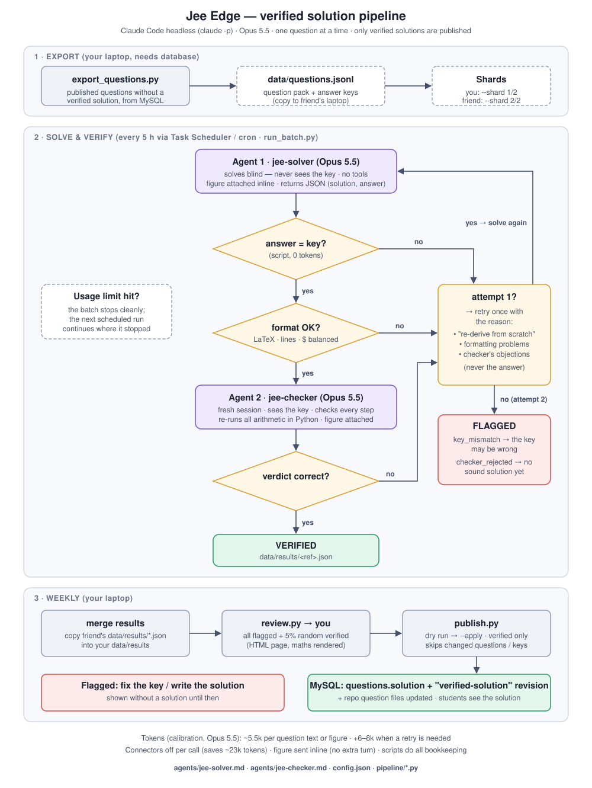
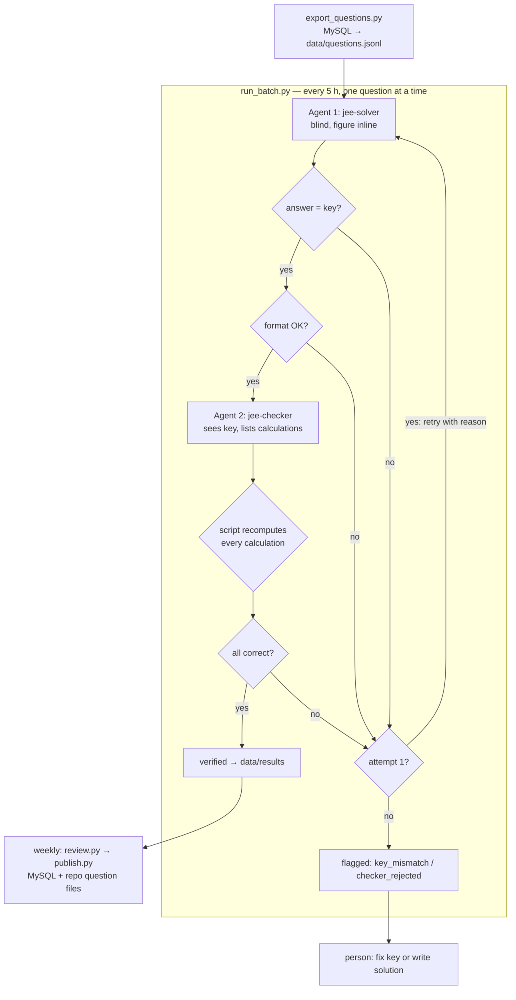

# Jee Edge — verified solution pipeline

Writes worked solutions for the question bank with **Claude Code (Opus 5.5)** and publishes only the ones that pass independent checks. Two agents, a few small scripts, no API key: it runs on a Claude subscription through the official `claude` CLI, in batches that fit the plan's 5-hour usage windows.



## The flow

For every question:

1. **Agent 1 — `jee-solver`** solves it **without seeing the answer key**, from the question text and the figure (attached to the message). It returns a LaTeX solution and a final answer as JSON.
2. **Script: answer = key?** Plain code compares the final answer with the official key (no tokens, the model can't talk itself into a match).
3. **Script: format OK?** Rejects solutions with no LaTeX, unbalanced `$`, or everything on one line, before any reviewer tokens are spent.
4. **Agent 2 — `jee-checker`** starts a fresh session, gets the question, the key and the solution, checks every step and **lists every calculation, which the script recomputes in Python**.
5. **Passed → verified.** Anything that fails gets **one retry**: the solver is told *why* (re-derive from scratch / the formatting problems / the checker's objections), never the answer. Failing twice → **flagged** for a person:
   - `key_mismatch`: the solver twice reached a different answer; often the **key is wrong** (e.g. a 2026 maths question keyed 11 whose correct answer is 6)
   - `checker_rejected`: the answer matches but no sound solution was produced

Weekly, on the laptop with database access: merge results, open the **review page** (all flagged + a 5% random sample of verified), then **publish** (dry run first). Only verified solutions are ever written.



## Folder

```
solution-pipeline/
  agents/jee-solver.md       Agent 1: model, tools and system prompt (front matter + body)
  agents/jee-checker.md      Agent 2
  config.json                batch size, workers, image URL, retry model, effort
  pipeline/run_batch.py      the loop above (solving machines)
  pipeline/claude_runner.py  one headless `claude -p` call
  pipeline/common.py         key comparison, formatting checks, figure download
  pipeline/status.py         progress and tokens
  pipeline/review.py         review page: flagged + random sample (HTML, maths rendered)
  pipeline/preview.py        student view of solved questions (options, figure, solution)
  pipeline/export_questions.py   database → question pack   (database machine only)
  pipeline/publish.py            verified results → database (database machine only)
  scripts/                   schedulers (Windows Task Scheduler, cron)
  data/                      pack, results, figures, logs, review pages (not in git)
```

The agent files use the same front matter as Claude Code subagents (`name`, `description`, `model`, `tools`), so they can also be copied to `.claude/agents/` and used interactively.

## Setup (each laptop)

1. **Python 3.10+** and **Claude Code** (`npm install -g @anthropic-ai/claude-code` or the native installer), then run `claude` once and log in with **your own** Claude account.
2. Copy this folder. Solving needs no Python packages.
3. Put the question pack at `data/questions.jsonl` (the database machine creates it, see below). Figures download automatically from the live site.
4. Test with 3 questions: `python pipeline/run_batch.py --limit 3` then `python pipeline/status.py`.

The database machine also needs: `pip install -r requirements.txt` and a `.env` (copy `.env.example`: `DATABASE_URL`, `DB_SSL_CA` pointing at the Aiven `ca.pem`).

## Commands

| What | Command | Who |
|---|---|---|
| Build / refresh the question pack | `python pipeline/export_questions.py` (options: `--year 2026 --exam jee_main --subject PHY --only-missing`) | database machine |
| Solve the next batch | `python pipeline/run_batch.py` (`--limit 50`, `--shard 1/2`, `--refs PYQ-...`) | any |
| Progress and tokens | `python pipeline/status.py [--shard 1/2]` | any |
| Review page | `python pipeline/review.py` → open `data/review/review-*.html` | database machine |
| Student-view preview | `python pipeline/preview.py [--all] [--refs PYQ-...]` → open `data/review/preview-*.html` | any |
| Publish (dry run / real) | `python pipeline/publish.py` / `python pipeline/publish.py --apply` | database machine |

**Two laptops, no overlap:** you run `--shard 1/2`, your friend `--shard 2/2`. Each machine always takes the same fixed half of the pack, so nobody solves a question twice and no coordination is needed. Your friend sends their `data/results/*.json` files back (zip, Drive, …); copy them into your `data/results/` before publishing. Already-solved questions are always skipped, so re-running is safe.

## Scheduling (every 5 hours)

- **Windows:** `powershell -ExecutionPolicy Bypass -File scripts\install_schedule_windows.ps1 -Shard 1/2` (runs while the laptop is on; logs in `data\logs\`). Remove: `Unregister-ScheduledTask -TaskName JeeEdgeSolutions -Confirm:$false`.
- **macOS / Linux:** `crontab -e` and add `7 */5 * * * /full/path/solution-pipeline/scripts/run_scheduled.sh 2/2`.
- Or in the **Claude Code desktop app**: create a local scheduled task every 5 hours whose prompt is *"Run `python pipeline/run_batch.py --shard 1/2` in the solution-pipeline folder and report the summary."*

Each run processes up to `questions_per_run` (config.json). If the plan's usage limit is reached mid-batch, the run **stops cleanly** and the next one continues.

## Tokens and limits (measured, Opus 5.5)

- ~**5.5k tokens per question** (text or figure), +6–8k for the ones that need a retry (~1 in 5–25).
- Two things keep it low: every call **switches off your MCP connectors** (they add ~23k tokens of tool definitions to each call otherwise) and the **figure is attached inline** (no file tool, no extra turn).
- With ~1M tokens per 5-hour window (your observation: 100k ≈ 10%), expect **~150 questions per window**; the weekly cap also applies. Start with `questions_per_run` ≈ 120 and adjust after checking Settings → Usage.
- `claude-sonnet-5` also works (set `model:` in the agent files) but in testing used ~45% more tokens and sometimes wrote maths without LaTeX; Opus is recommended.

## Rules

- **One Claude account per person.** Two people each running their own shard on their own subscription is fine; one person rotating accounts to get around usage limits is treated as limit evasion and risks suspension.
- `data/questions.jsonl` contains answer keys and `data/results` contains unpublished solutions: keep `data/` out of git and share it only with people running the pipeline.
- A person decides every flagged question. Checking the random sample on each review page is how you know the real error rate; the pipeline reduces errors, it cannot promise zero.

## Troubleshooting

- `claude: command not found` in a scheduled run: use the full path to `claude`, or add its folder to PATH in `scripts/run_scheduled.*`.
- Results with verdict `error`: the call failed (network, timeout); delete that `data/results/<ref>.json` to retry it.
- `publish.py` skips a question as "changed since export": re-export the pack, delete that result file, and let it be solved again.
